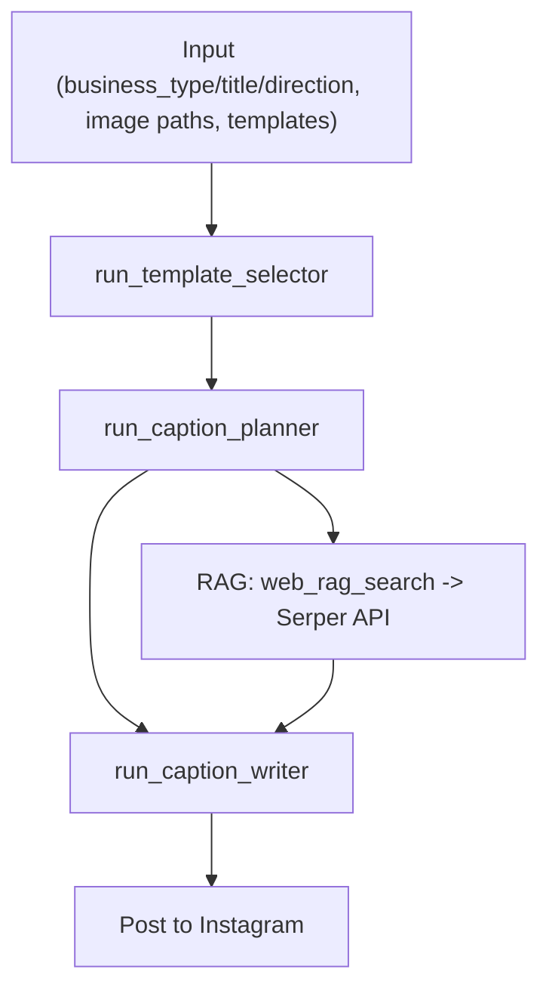

# instagram-auto-post-system

Auto pipeline for Instagram: generate caption → upload images → post a carousel via Instagram Graph API. Works from notebooks or scripts by calling exported functions.

## How it works
- `main.auto_post_instagram()`: orchestrates everything. Inputs: `user_input` (business_type, title, direction), image paths, and template JSON. Outputs: final caption + posts to Instagram.
- `utils/caption_agent.py` (caption pipeline):
  1. `run_template_selector`: choose the best template via LLM.
  2. `run_caption_planner`: create a caption outline and RAG queries.
  3. `web_rag_search`: fetch supporting info via Serper.
  4. `run_caption_writer`: craft the final caption using outline + RAG + style rules.
  5. `generate_instagram_caption()`: returns all intermediates and the final caption.
- `utils/post_instagram.py` (posting):
  - `upload_to_gcs`: upload images to GCS and create signed URLs.
  - `create_child_media` → `publish_carousel`: create child media then publish the carousel via Instagram Graph API.
  - `post_to_instagram()`: takes image paths + caption and completes the post.
- `utils/llm.py`: thin wrapper for OpenAI Chat Completions (`run_gpt`, `run_gpt_json`).
- `utils/template_generator.py` (template builder):
  - `generate_template_from_post`: turn an existing caption into a reusable template JSON that matches `utils/template_example.json`.
- `utils/template_example.json`: sample templates (structure, style, hashtags).

## Required environment variables (.env supported)
- `OPENAI_API_KEY`
- `SERPER_API_KEY`
- `GOOGLE_APPLICATION_CREDENTIALS`
- `GCS_BUCKET_NAME`
- `IG_USER_ID`
- `IG_ACCESS_TOKEN`

## Quick start
Deps: `openai`, `python-dotenv`, `google-cloud-storage`, `requests`

```bash
pip install openai python-dotenv google-cloud-storage requests
```

```python
import json
from main import auto_post_instagram

user_input = {
    "business_type": "travel_agency",
    "title": "Kyoto private tour",
    "direction": "story"
}

with open("utils/template_example.json", "r", encoding="utf-8") as f:
    templates = json.load(f)

image_paths = ["images/sample1.png", "images/sample2.png"]
auto_post_instagram(user_input, image_paths, templates)
```

## Generate a template from a real caption
If you like the style or structure of an existing post, convert it into a reusable template and feed it back into the caption pipeline.

```python
import json
from utils.template_generator import generate_template_from_post

caption_text = """
Paste the original caption text here as-is.
"""

# Create one template dict that matches utils/template_example.json
template = generate_template_from_post(caption_text)

with open("utils/template_generated.json", "w", encoding="utf-8") as f:
    json.dump(template, f, ensure_ascii=False, indent=2)

# You can now pass this template back into the main flow
templates = {"categories": [template]}
```

## Dependency diagram

