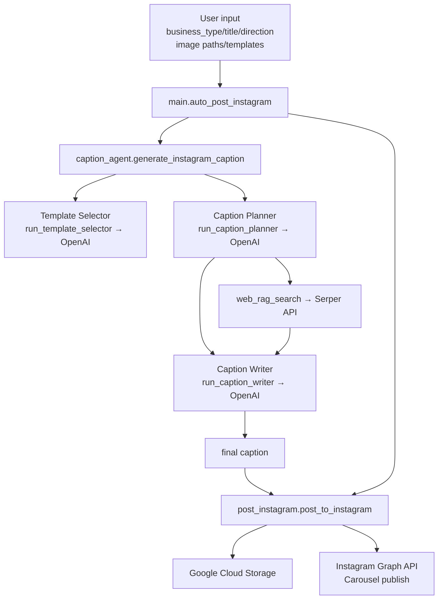

# instagram-auto-post-system

Instagram へ「キャプション生成 → 画像アップロード → カルーセル投稿」までを自動化するツール群です。現在の実装は Notebook/スクリプトから関数を呼び出す形で動作します。

## 仕組みの流れ
- `main.auto_post_instagram()` が司令塔。`user_input`（事業種別・タイトル・方向性）、ローカル画像パス、テンプレート JSON を受け取り、キャプション生成と投稿を一括実行します。
- キャプション生成は `utils/caption_agent.py` のパイプラインで実施  
  1) Template Selector: タイトル/方向性から最適なテンプレートを LLM で選択 (`run_template_selector`)  
  2) Caption Planner: 選択テンプレートを元に構成案と RAG 用クエリを生成 (`run_caption_planner`)  
  3) Web RAG: Serper API で必要情報を検索し要約 (`web_rag_search`)  
  4) Caption Writer: RAG 結果とテンプレートの文体規則を使い最終キャプションを生成 (`run_caption_writer`)  
  5) `generate_instagram_caption()` は上記の中間結果と最終キャプションを返します。
- 投稿は `utils/post_instagram.py` が担当  
  - 画像を GCS へアップロードし署名付き URL を作成 (`upload_to_gcs`)  
  - Instagram Graph API で子メディアを作成 → 親カルーセルを publish (`create_child_media`, `publish_carousel`)  
  - `post_to_instagram()` は画像リストとキャプションを受け取りカルーセル投稿まで完結させます。
- LLM 呼び出しは `utils/llm.py` でラップしており、OpenAI Chat Completions を利用します。

## モジュールと役割
- `main.py` : エントリーポイントとなる `auto_post_instagram()` を提供。
- `utils/caption_agent.py` : テンプレート選択／構成案生成／RAG／キャプション生成の一連処理。
- `utils/llm.py` : OpenAI API 呼び出しの薄いラッパー (`run_gpt`, `run_gpt_json`)。
- `utils/post_instagram.py` : GCS へのアップロードと Instagram Graph API でのカルーセル投稿。
- `utils/template_example.json` : テンプレートのサンプル（カテゴリ名・構成・文体・ハッシュタグ方針など）。

## 必要な環境変数（.env 読み込み対応）
- `OPENAI_API_KEY` : LLM 呼び出し用
- `SERPER_API_KEY` : Web 検索（Serper）
- `GOOGLE_APPLICATION_CREDENTIALS` : GCS 用サービスアカウント JSON のパス
- `GCS_BUCKET_NAME` : 画像を置く GCS バケット名
- `IG_USER_ID` : Instagram Graph API のユーザー ID
- `IG_ACCESS_TOKEN` : Instagram Graph API トークン


```

## 依存関係ダイアグラム

